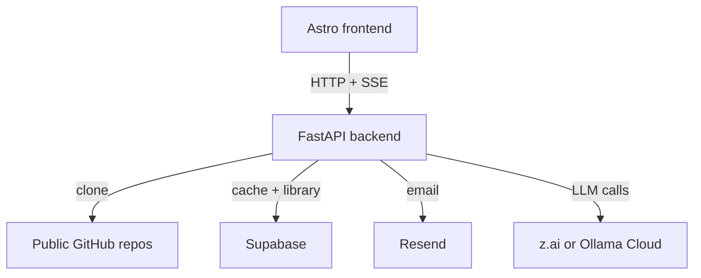
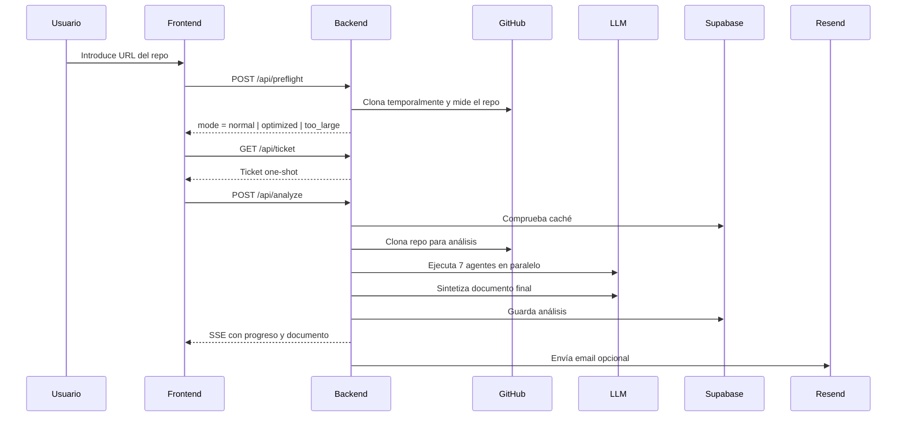

# IWTBI

> Plataforma web que convierte repositorios públicos de GitHub en briefs técnicos accionables para desarrolladores y agentes de código.

**Repositorio:** `686f6c61/iwtbi`  **Tecnología principal:** Python + FastAPI en backend, Astro + TypeScript en frontend

## ¿Qué es este proyecto?

IWTBI es una aplicación full-stack orientada a analizar repositorios públicos y transformarlos en documentación útil para reconstrucción, revisión o extensión del software analizado. El producto combina una experiencia web cuidada, una API asíncrona y un pipeline de análisis con varios agentes especializados que trabajan en paralelo sobre un contexto de código priorizado. El sistema no intenta leer un repositorio completo sin control: primero mide su tamaño útil, decide si puede procesarlo con garantías y solo después lanza el análisis. El resultado final se persiste en Supabase para crear una biblioteca pública de análisis reutilizables y, opcionalmente, se notifica por email al usuario cuando el trabajo termina. El enfoque general es producto primero: control de costes de contexto, UX clara durante la espera y degradación elegante cuando un proveedor LLM falla o tarda demasiado.

## Resumen para reconstrucción con IA

Construye una aplicación web con un frontend estático en Astro servido por nginx y un backend en FastAPI que analiza repositorios públicos de GitHub. El backend debe validar la URL, ejecutar un preflight para medir contexto útil del repositorio, emitir un ticket one-shot para proteger el inicio del análisis y lanzar un pipeline asíncrono con siete agentes especializados: stack, arquitectura, base de datos, API, frontend, lógica y despliegue. El repositorio se clona temporalmente, se recorre de forma determinista, se filtran directorios irrelevantes y se seleccionan archivos prioritarios hasta un presupuesto global de caracteres. La síntesis final debe intentar una redacción completa, luego una síntesis de rescate y, si ambas fallan, un documento determinista para no perder el análisis. Guarda los documentos en Supabase junto con `repo_full_name`, `git_sha` y `tags`, expón una biblioteca paginada y permite notificaciones por correo con Resend. Despliega ambos servicios con Docker Compose detrás de un proxy TLS.

---

## Stack tecnológico

### Backend

| Componente | Uso |
| --- | --- |
| Python `>=3.12` | Lenguaje principal del backend |
| FastAPI | API HTTP y endpoints de análisis |
| Uvicorn | Servidor ASGI |
| LangChain | Orquestación de agentes LLM |
| `langchain-openai` | Integración con proveedores OpenAI-compatible |
| `langchain-ollama` + `ollama` | Integración con Ollama Cloud |
| `pydantic-settings` | Configuración por variables de entorno |
| `slowapi` | Rate limiting por IP |
| `supabase` | Persistencia de análisis y notificaciones |
| `resend` | Email opcional de “análisis listo” |

### Frontend

| Componente | Uso |
| --- | --- |
| Astro | Sitio estático y páginas del producto |
| TypeScript | Lógica cliente en páginas interactivas |
| nginx | Servido del frontend generado |
| `marked` | Renderizado de Markdown |
| `DOMPurify` | Saneado de HTML generado |
| `mermaid` | Renderizado de diagramas en los análisis |

### Infraestructura

| Pieza | Uso |
| --- | --- |
| Docker Compose | Orquestación local y productiva |
| Supabase/PostgreSQL | Base de datos gestionada |
| Resend | Notificaciones por email |
| GitHub | Fuente de repositorios públicos a clonar |
| z.ai u Ollama Cloud | Proveedor LLM configurable |

### Configuración operativa relevante

| Variable | Valor por defecto | Propósito |
| --- | --- | --- |
| `REPO_SIZE_LIMIT_MB` | `100` | Bloqueo de repos muy pesados antes del análisis |
| `FILE_SIZE_LIMIT_KB` | `500` | Límite por archivo |
| `MAX_FILES` | `2000` | Máximo de archivos considerados por el lector |
| `PREFLIGHT_MAX_CANDIDATE_FILES` | `750` | Corte público para repos grandes |
| `MAX_CONTEXT_CHARS` | `80000` | Presupuesto global de contexto |
| `ANALYZE_RATE_LIMIT` | `5/hour` | Protección del endpoint costoso |
| `TICKET_RATE_LIMIT` | `30/minute` | Límite de emisión de tickets |
| `PREFLIGHT_RATE_LIMIT` | `12/minute` | Límite de medición de repos |

---

## Arquitectura



### Componentes principales

1. **Frontend estático**
   - Renderiza páginas de marketing y producto.
   - Inicia `preflight`, solicita ticket, lanza análisis y consume el stream SSE.
   - Renderiza documentos Markdown con Mermaid y saneado HTML.

2. **Backend FastAPI**
   - Expone el API público.
   - Gestiona tickets efímeros y jobs en memoria.
   - Orquesta clonado, lectura, agentes, síntesis y persistencia.

3. **Store en memoria**
   - Guarda jobs activos, estados, documentos y errores durante la ejecución.
   - No sobrevive a reinicios del proceso.

4. **Capa de persistencia**
   - Guarda análisis finales en Supabase para caché y biblioteca.
   - Guarda solicitudes de notificación por email asociadas a jobs.

5. **Proveedor LLM**
   - Se abstrae vía configuración.
   - Puede ser `zai` o `ollama_cloud`.

### Flujo de alto nivel



### Decisiones estructurales importantes

- El frontend es estático y delega toda la inteligencia en el backend.
- La lectura del repo es determinista y priorizada; no depende del LLM para decidir qué archivos entran.
- El sistema protege los endpoints de escritura con proxy + ticket + rate limits.
- La persistencia solo guarda documentos finales; los jobs activos son efímeros.
- La aplicación está pensada para convivir con otros proyectos en el mismo VPS publicando puertos solo en loopback en producción.

---

## Base de datos

El esquema canónico vive en `backend/supabase/schema.sql` y crea dos tablas principales.

### Tabla `analyses`

| Campo | Tipo | Propósito |
| --- | --- | --- |
| `id` | `uuid` | Identificador interno |
| `repo_url` | `text unique` | URL del repositorio analizado |
| `repo_full_name` | `text` | Formato `owner/repo` |
| `document` | `text` | Markdown final del análisis |
| `git_sha` | `text` | Commit usado en el análisis |
| `tags` | `jsonb` | Topics del repo en GitHub |
| `created_at` | `timestamptz` | Fecha de creación |
| `updated_at` | `timestamptz` | Fecha de actualización |

Características:

- `updated_at` se mantiene con trigger.
- Índice GIN sobre `tags`.
- RLS habilitado.
- Política pública de lectura para poder servir la biblioteca sin auth.

### Tabla `repo_notifications`

| Campo | Tipo | Propósito |
| --- | --- | --- |
| `id` | `uuid` | Identificador interno |
| `job_id` | `text` | Job asociado al análisis |
| `repo_url` | `text` | Repo solicitado |
| `email` | `text` | Destinatario |
| `sent_at` | `timestamptz` | Marca de envío |
| `created_at` | `timestamptz` | Fecha de alta |

Características:

- Índice sobre `job_id`.
- RLS habilitado.
- Política restrictiva para impedir acceso público.

### Papel real de Supabase en el producto

- Caché de análisis ya ejecutados.
- Fuente de datos de la biblioteca pública.
- Cola ligera de notificaciones asociadas a análisis terminados.

---

## API y contratos

### Endpoints públicos

| Endpoint | Método | Propósito |
| --- | --- | --- |
| `/health` | `GET` | Healthcheck |
| `/api/preflight` | `POST` | Medir repo y clasificarlo |
| `/api/ticket` | `GET` | Emitir ticket efímero |
| `/api/analyze` | `POST` | Iniciar análisis o devolver caché |
| `/api/stream/{job_id}` | `GET` | SSE de progreso |
| `/api/biblioteca` | `GET` | Listado paginado |
| `/api/biblioteca/{owner}/{repo}` | `GET` | Documento final guardado |

### Contrato de `preflight`

Entrada:

```json
{
  "url": "https://github.com/owner/repo"
}
```

Salida esperada:

```json
{
  "mode": "normal",
  "reason": "fits_context",
  "candidate_files": 42,
  "selected_files": 18,
  "total_candidate_chars": 25193,
  "selected_chars": 25193,
  "oversized_files": 0,
  "budget_truncated_files": 0,
  "candidate_file_limit": 750
}
```

Modos:

- `normal`: el repo entra con margen.
- `optimized`: el repo se analizará priorizando archivos clave.
- `too_large`: el plan gratuito lo bloquea.

### Contrato de `analyze`

Entrada:

```json
{
  "url": "https://github.com/owner/repo",
  "force_new": false,
  "email": "user@example.com"
}
```

Requisitos:

- Debe incluir `X-Ticket`.
- Si el análisis ya existe y no se fuerza uno nuevo, puede devolver respuesta cacheada.

Respuestas:

- **Cacheada:** devuelve documento y metadatos.
- **Nueva:** devuelve `job_id` y `stream_url`.

### Eventos SSE

| Evento | Significado |
| --- | --- |
| `status` | Cambia de fase |
| `agent` | Un agente terminó su sección |
| `agent_error` | Un agente falló pero el pipeline sigue |
| `complete` | Documento listo |
| `analysis_error` | El job no puede completarse |

Fases esperadas:

- `cloning`
- `analyzing`
- `synthesizing`

### Seguridad aplicada

- Validación de origen en el proxy para endpoints de escritura.
- Ticket one-shot ligado a fingerprint del cliente.
- Rate limits por IP con `slowapi`.
- CORS restringido al frontend permitido.
- Sin acceso directo del frontend a Supabase.

---

## Frontend

### Páginas principales

| Ruta | Función |
| --- | --- |
| `/` | Landing y formulario principal |
| `/analyze` | Flujo de análisis con progreso en tiempo real |
| `/biblioteca` | Listado paginado de análisis guardados |
| `/biblioteca/view` | Visualización de un análisis individual |
| `/como-funciona` | Explicación del producto |
| `/legal` | Privacidad y condiciones |

### Comportamientos clave

- La home permite pegar la URL del repo y arrancar el flujo.
- El CTA principal tiene interacciones visuales orientadas a guiar al usuario hacia el buscador.
- La pantalla de análisis abre un modal previo con email opcional, aceptación de privacidad y estado de medición del repo.
- El frontend ejecuta `preflight` antes de iniciar el análisis.
- Si el repo es demasiado grande, bloquea el inicio y explica el límite del plan gratuito.
- Si el usuario aporta email, el sistema puede continuar aunque cierre la pestaña.
- El documento final se renderiza con `marked`, `DOMPurify` y `mermaid`.
- La biblioteca carga los análisis desde la API, pagina de 21 en 21 y permite ordenar.

### UI y producto

- El diseño es deliberadamente gráfico, con estética editorial/brutalista.
- La aplicación usa mensajes de estado muy explícitos para reducir incertidumbre durante la espera.
- Hay tratamiento específico para móvil tanto en la home como en la vista de análisis.

### Dependencia build-time importante

`PUBLIC_BACKEND_URL` se inyecta en el build del frontend. No es una variable runtime servida por nginx después de compilar.

---

## Lógica de negocio

### Regla principal del producto

IWTBI no resume un repo sin control: primero decide si el análisis es viable dentro de un coste de contexto razonable y después ejecuta un pipeline especializado para devolver un documento útil para reconstrucción.

### Fases del pipeline

1. Validar URL GitHub pública.
2. Medir el repo con `preflight`.
3. Solicitar ticket efímero.
4. Comprobar caché de análisis existente.
5. Clonar el repo en un directorio temporal.
6. Construir árbol completo y contexto priorizado.
7. Ejecutar 7 agentes en paralelo.
8. Sintetizar el documento final.
9. Guardarlo en Supabase.
10. Emitir evento `complete` y, si procede, enviar emails.

### Criterios de priorización del código

El lector prioriza:

- `README`
- manifests (`package.json`, `pyproject.toml`, etc.)
- archivos de entrada
- configuración
- migraciones y esquemas
- archivos de lógica cerca de la raíz

Y reduce o excluye:

- binarios
- symlinks
- artefactos generados
- dependencias instaladas
- builds y caches

### Modelo de degradación

- Si fallan algunos agentes, el resto continúa.
- Si la síntesis principal falla, se intenta una síntesis de rescate.
- Si la síntesis de rescate falla, se monta un documento determinista.
- Si falla GitHub metadata o email, el análisis principal no debe romperse.

### Restricciones funcionales relevantes

- Solo analiza repositorios públicos.
- El store de jobs es en memoria.
- Los trabajos activos no son reanudables tras reinicios del proceso.
- La biblioteca es pública por diseño.

---

## Puesta en marcha y despliegue

### Desarrollo local

1. Copiar el archivo de entorno:

   ```bash
   cp .env.example .env
   ```

2. Rellenar al menos:
   - un proveedor LLM
   - `SUPABASE_URL`
   - `SUPABASE_SERVICE_KEY`

3. Levantar el stack:

   ```bash
   docker compose up --build
   ```

4. Verificar:
   - frontend: `http://localhost:3410`
   - backend: `http://localhost:8410/health`

5. Inicializar Supabase:

   ```bash
   psql "<your-postgres-connection-string>" -f backend/supabase/schema.sql
   ```

### Producción

- El frontend escucha en `8080` dentro del contenedor.
- El backend escucha en `8000` dentro del contenedor.
- Ambos servicios publican a `127.0.0.1` por defecto en producción.
- `docker-compose.prod.yml` espera un proxy inverso con TLS por delante.

Comandos documentados:

```bash
docker compose -f docker-compose.prod.yml build
docker compose -f docker-compose.prod.yml up -d
```

### Topología recomendada

- Contenedor frontend sirviendo Astro estático por nginx.
- Contenedor backend sirviendo FastAPI.
- Proxy inverso terminando TLS.
- Supabase como persistencia gestionada.
- Resend opcional para notificaciones.

### Checks operativos

1. `/health` devuelve `status: ok`.
2. `preflight` funciona desde el origen permitido.
3. `ticket` funciona desde el origen permitido.
4. Un análisis completo se guarda en Supabase.
5. La biblioteca puede leerlo.
6. Los correos opcionales se entregan.

---

## Instrucciones de construcción paso a paso

1. Crear un repositorio nuevo con dos aplicaciones hermanas, `frontend/` y `backend/`, y una carpeta `docs/` para documentación de producto y despliegue. Comando no documentado — usar el estándar del framework.
2. Preparar el backend en Python `>=3.12` con FastAPI, Uvicorn, LangChain, `langchain-openai`, `langchain-ollama`, `pydantic-settings`, `supabase`, `resend` y `slowapi`, de forma que toda la configuración cargue desde variables de entorno.
3. Crear el archivo de configuración global del backend para centralizar proveedor LLM, límites de contexto, límites de tasa, claves de Supabase, integración con Resend y puertos del sistema.
4. Implementar un `JobStore` en memoria que permita crear jobs, actualizar su estado, guardar documento final, registrar errores y mantener los trabajos vivos el tiempo suficiente para que el cliente pueda recoger el resultado.
5. Construir el lector de repositorios que recorra el árbol completo, excluya directorios generados, detecte binarios, puntúe archivos por prioridad y seleccione contenidos hasta un presupuesto global de `MAX_CONTEXT_CHARS`.
6. Implementar el endpoint `POST /api/preflight` para clonar temporalmente un repo público, medir `candidate_files`, `selected_files` y `selected_chars`, y devolver uno de los modos `normal`, `optimized` o `too_large`.
7. Implementar el endpoint `GET /api/ticket` para emitir tickets one-shot y el endpoint `POST /api/analyze` para validar la URL, aceptar `force_new`, registrar email opcional, reutilizar caché cuando exista y lanzar el pipeline asíncrono.
8. Añadir el endpoint `GET /api/stream/{job_id}` con Server-Sent Events para emitir `status`, `agent`, `agent_error`, `complete` y `analysis_error` durante toda la vida del análisis.
9. Crear siete agentes especializados para stack, arquitectura, base de datos, API, frontend, lógica y despliegue, y un sintetizador final que intente primero una síntesis completa, luego una de rescate y finalmente un documento determinista.
10. Definir el esquema SQL de Supabase con las tablas `analyses` y `repo_notifications`, el trigger de `updated_at`, el índice GIN para `tags` y las políticas RLS de lectura pública para biblioteca y cierre total para notificaciones.
11. Construir el frontend en Astro con una home para pegar la URL, una vista `/analyze` con modal previo, preflight, ticket, consumo de SSE y renderizado Markdown con `marked`, `DOMPurify` y `mermaid`, y una biblioteca pública paginada con ordenación y vista individual.
12. Añadir archivos `.env.example`, `docker-compose.yml`, `docker-compose.prod.yml` y una plantilla de proxy nginx para que el sistema pueda arrancar en local y desplegarse detrás de TLS sin exponer el backend públicamente.
13. Copiar el archivo de entorno con `cp .env.example .env`, rellenar al menos proveedor LLM, `SUPABASE_URL` y `SUPABASE_SERVICE_KEY`, y arrancar la pila con `docker compose up --build`.
14. Inicializar la base de datos con `psql "<your-postgres-connection-string>" -f backend/supabase/schema.sql` y verificar que el backend responde en `http://localhost:8410/health`.
15. Preparar producción con `docker compose -f docker-compose.prod.yml build` y `docker compose -f docker-compose.prod.yml up -d`, poner un proxy TLS delante y validar de extremo a extremo que el análisis se guarda en biblioteca y, si hay `RESEND_API_KEY`, que el correo de “análisis listo” también se envía.
