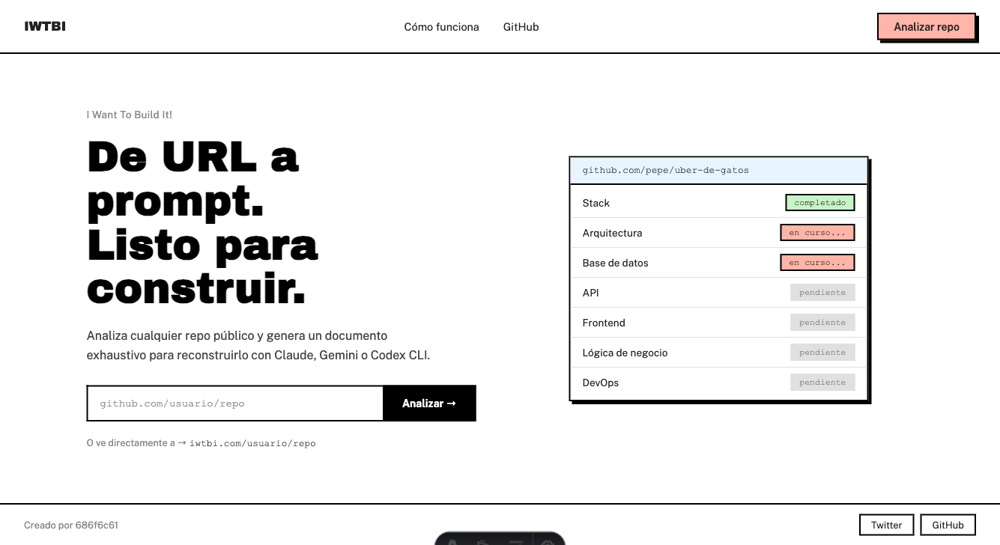
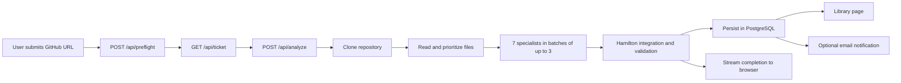
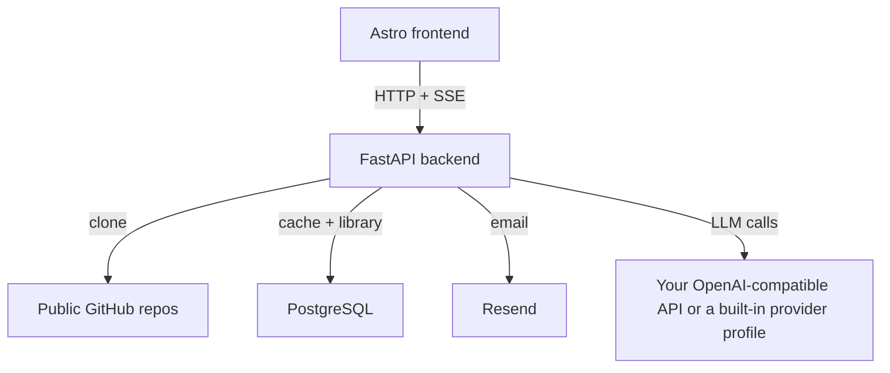

# IWTBI

IWTBI turns a public GitHub repository into an actionable build brief for coding agents and developers. Paste a repo URL, run the analysis pipeline, and get a structured document you can use to rebuild, extend, or review the project.

The application ships as a small monorepo:

- `frontend/`: Astro static site served by nginx
- `backend/`: FastAPI API, analysis orchestration, caching, and email fanout
- `backend/postgres/`: canonical SQL schema for saved analyses and notifications
- `ops/`: deployment examples

## Home screenshot



## What the product does

- Measures a repository before analysis to decide whether it fits the safe context budget.
- Runs a multi-agent backend pipeline over the cloned repository.
- Supports private server-managed AI profiles for controlled internal analyses.
- Streams progress to the browser through Server-Sent Events (SSE).
- Saves completed analyses to internal PostgreSQL and exposes them in a public library.
- Optionally emails users when an analysis finishes.

## Core product flow



## Architecture at a glance



## Analysis agents

- Grace Hopper: stack, versions, dependencies and build commands.
- Alan Kay: architecture, modules, exact paths and relationships.
- Barbara Liskov: data models, schemas, migrations and persistence.
- Roy Fielding: APIs, authentication, events and data contracts.
- Hedy Lamarr: screens, components, states and responsive behavior.
- Donald Knuth: business rules, algorithms and edge cases.
- Lynn Conway: environments, containers, CI/CD and deployment.
- Margaret Hamilton: cross-cutting build order, global acceptance criteria,
  evidence and unresolved questions. Specialist sections remain intact.

The seven specialists run as independent LLM calls in batches of at most three.
Hamilton runs after them as a separate integration call.

## Repository layout

```text
.
|- backend/
|  |- app/
|  |- tests/
|  `- postgres/
|- frontend/
|  |- src/
|  `- public/
|- docs/
|- ops/
`- docker-compose.yml
```

## Quick start

1. Create a private `.env` with fresh local secrets:

   ```bash
   ./scripts/init-self-host.sh
   ```

2. Add your own AI endpoint, model and API key to `.env`. The default
   `openai_compatible` profile works with OpenAI-compatible services. NaN,
   z.ai and Ollama Cloud profiles are also available.

   Administrators can define private profiles in `LLM_PROFILES_JSON` for the
   protected internal route. They are not shown in the public frontend.

3. Start the stack:

   ```bash
   docker compose up --build
   ```

4. Open:
   - frontend: [http://localhost:3410](http://localhost:3410)
   - backend health: [http://localhost:8410/health](http://localhost:8410/health)

5. PostgreSQL starts empty and applies the schema automatically. Initialize it
   manually only when running without Docker Compose:

   ```bash
   psql "$DATABASE_URL" -f backend/postgres/schema.sql
   ```

   The default Docker Compose stack starts PostgreSQL and applies this schema
   automatically on first boot.

## Documentation

- [Getting started](docs/getting-started.md)
- [Configuration reference](docs/configuration.md)
- [Architecture](docs/architecture.md)
- [API and SSE flow](docs/api.md)
- [Deployment guide](docs/deployment.md)
