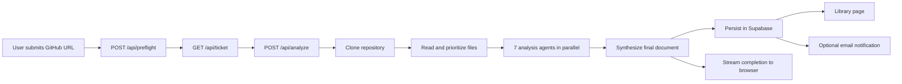
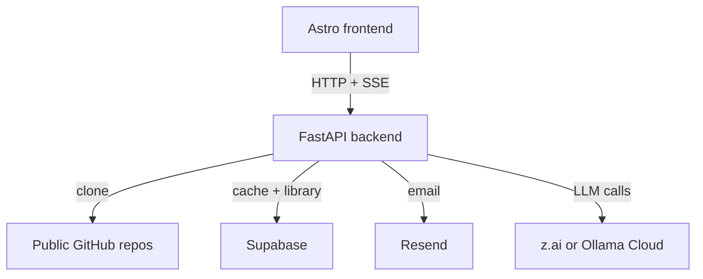

# IWTBI

IWTBI turns a public GitHub repository into an actionable build brief for coding agents and developers. Paste a repo URL, run the analysis pipeline, and get a structured document you can use to rebuild, extend, or review the project.

The application ships as a small monorepo:

- `frontend/`: Astro static site served by nginx
- `backend/`: FastAPI API, analysis orchestration, caching, and email fanout
- `backend/supabase/`: canonical SQL schema for saved analyses and notifications
- `ops/`: deployment examples

## Home screenshot


## What the product does

- Measures a repository before analysis to decide whether it fits the safe context budget.
- Runs a multi-agent backend pipeline over the cloned repository.
- Streams progress to the browser through Server-Sent Events (SSE).
- Saves completed analyses to Supabase and exposes them in a public library.
- Optionally emails users when an analysis finishes.

## Core product flow



## Architecture at a glance



## Repository layout

```text
.
|- backend/
|  |- app/
|  |- tests/
|  `- supabase/
|- frontend/
|  |- src/
|  `- public/
|- docs/
|- ops/
`- docker-compose.yml
```

## Quick start

1. Copy the root example file:

   ```bash
   cp .env.example .env
   ```

2. Fill in at least:
   - one model provider
   - `SUPABASE_URL`
   - `SUPABASE_SERVICE_KEY`

3. Start the stack:

   ```bash
   docker compose up --build
   ```

4. Open:
   - frontend: [http://localhost:3410](http://localhost:3410)
   - backend health: [http://localhost:8410/health](http://localhost:8410/health)

5. Initialize Supabase:

   ```bash
   psql "<your-postgres-connection-string>" -f backend/supabase/schema.sql
   ```

   You can also paste the file into the Supabase SQL editor.

## Documentation

- [IWTBI self-analysis brief](IWTBI_ANALYSIS.md)
- [Getting started](docs/getting-started.md)
- [Configuration reference](docs/configuration.md)
- [Architecture](docs/architecture.md)
- [API and SSE flow](docs/api.md)
- [Deployment guide](docs/deployment.md)
