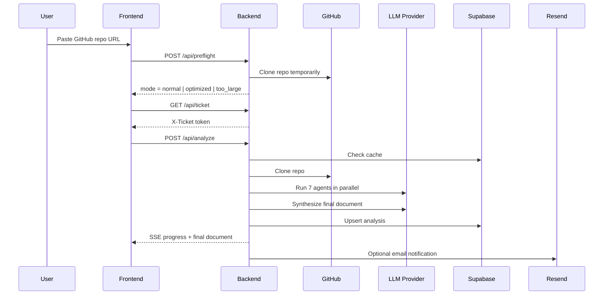

# Architecture

This document explains how IWTBI is put together and how a repository moves through the system.

## High-level components

### Frontend

- Astro static site
- Served by nginx
- Main pages:
  - `/`
  - `/analyze`
  - `/biblioteca`
  - `/biblioteca/view`
  - `/como-funciona`
  - `/legal`

### Backend

- FastAPI application
- In-memory job store for active runs and one-shot tickets
- Repository cloning and prioritization logic
- Parallel multi-agent analysis pipeline
- SSE stream for real-time progress

### External dependencies

- GitHub for repository clone and metadata
- Supabase for saved analyses and email subscriptions
- Resend for optional email delivery
- One LLM provider: z.ai or Ollama Cloud

## Request lifecycle

## Analysis pipeline

The backend performs the analysis in these phases:

1. Validate the GitHub URL
2. Preflight the repo size and useful context
3. Clone the repository
4. Build a deterministic file tree and prioritized context bundle
5. Run 7 specialized agents in parallel
6. Synthesize a final document
7. Save the result to Supabase
8. Fan out email notifications if needed

## Agent layout

The current pipeline uses these analysis agents:

- stack
- architecture
- database
- api
- frontend
- logic
- devops

Their outputs are merged by a final synthesizer. If normal synthesis fails, the backend tries a rescue synthesis, then a deterministic fallback document so the run can still close cleanly.

## File prioritization

The reader does not dump every file into the model context. Instead it:

- walks the full repository tree
- filters out generated or irrelevant directories
- scores files by importance
- includes contents until the global character budget is exhausted

Priority is biased toward:

- `README`
- manifests
- entrypoints
- config files
- schema and migration files
- core source files near the repository root

## Persistence model

Supabase stores two main datasets:

### `analyses`

- cached analysis per repository URL
- final markdown document
- repo full name
- git SHA
- tags/topics from GitHub
- timestamps

### `repo_notifications`

- email subscriptions for in-flight jobs
- one row per requested notification
- `sent_at` timestamp once delivered

## Failure model

IWTBI is designed to degrade gracefully:

- GitHub metadata failures do not block the analysis
- agent-level failures emit `agent_error` but keep the pipeline running
- synthesis retries before falling back
- email delivery is best-effort and never breaks the main flow

## What is intentionally not public-facing

Internal planning docs, prompt design notes, and implementation planning artifacts live under `docs/superpowers/` in the working repository and are excluded from the public copy generator.
